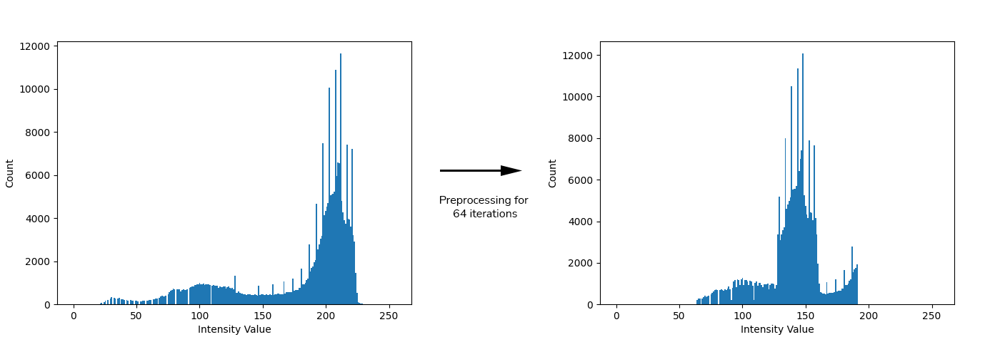
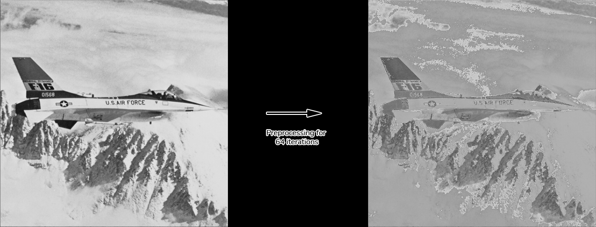
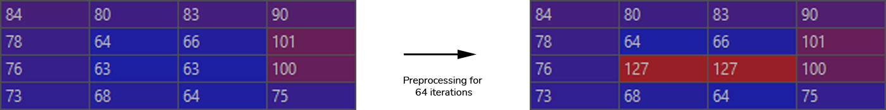
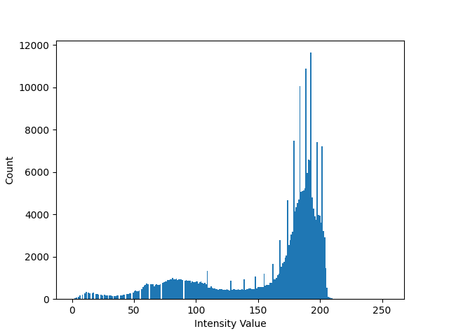
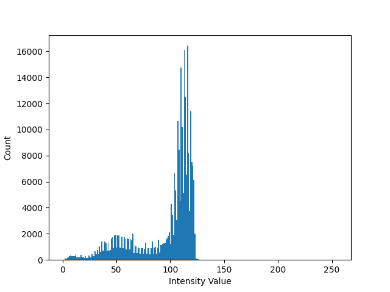
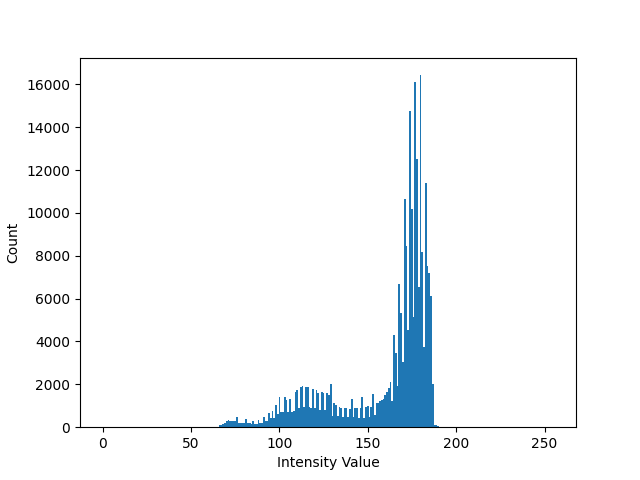
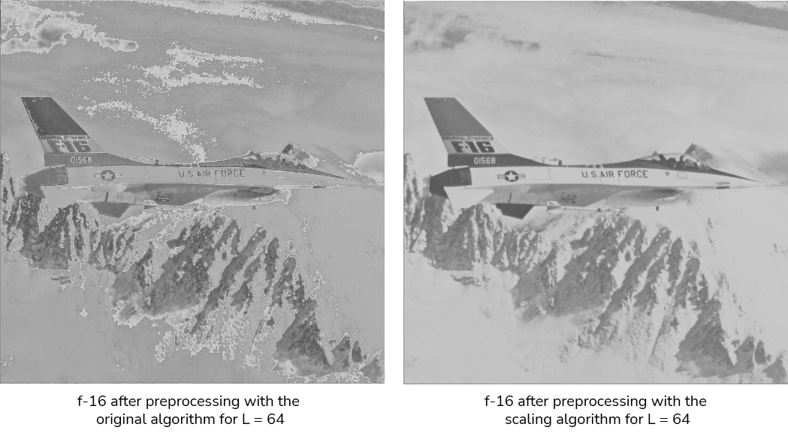
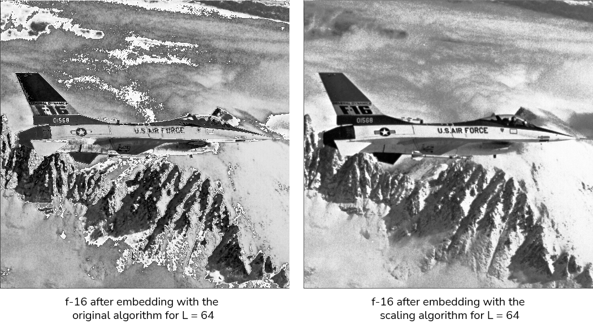
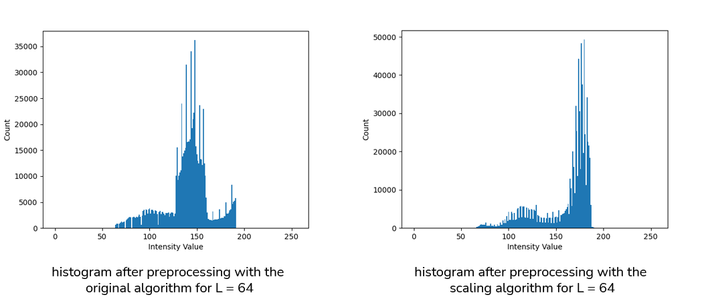
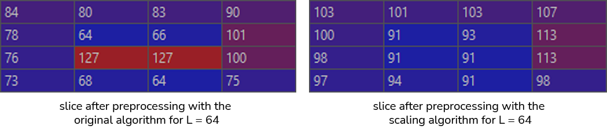

# Background

The algorithm described in the original paper (Reversible Image Data Hiding with Contrast Enhancement) requires clearing
the first and last L values from the histogram in the preprocessing step, where L is the number of pairs of histogram
peaks split for data embedding. The paper resolves this by adding L to values in [0, L - 1] and [256 - L, 255] and
keeping a map which tell us which pixels were modified, so we can recover the original image in the extraction process
and make it completely lossless.

    

Looking at the resulting image after preprocessing we can see that it causes distortion:

  

If we look closely at the pixel values before and after preprocessing for a small segment of the image we can see what's
causing this:

  

Values that are a little below L increase by L while values that are above stay the same which translates into really
visible distortion in the image.

# Solution

Instead of adding and subtracting L from the pixel values to clear [0, L - 1] and [256 - L, 255], we can linearly scale
the image to fit in [L, 255 - L].

#### Main Algorithm

1. Shift the image to the left by the minimum value in it.  
     

1. Find the scale factor with the following formula:  
   `scale_factor = (255 - 2 * L) / range`  
   Where `range` is the maximum value in the image after shifting in the first step.
1. Multiply the image with the scaling factor and round the values up to the nearest integer.  
     

1. Now we have `2 * L` bins cleared from the upper part of the image. We want to clear   [0, L - 1] and [256 - L, 255]
   so we add L to the image to achieve that.  
     

#### Finding the Map

We want to be able to recover the image losslessly, so we have to keep a map that enables us to do that. This map is
calculated by doing the following steps before adding L to image in the last step:

1. Divide the image by the scale factor we calculated in step 2 earlier and round the values down to reverse the scaling
   operation.
1. Some values won't be correctly recovered, and we need the map to mark these pixels. We find the map by subtracting
   the partially recovered image from the original image. The result will tell us which pixels were not recovered
   correctly and in the extraction process we can use that map to recover the original image by adding each pixel to its
   corresponding value in the map.

As long as the scale factor is bigger than or equal to 0.5, the map will only have values between [0, 1] so we can
represent each pixel with only a single bit in the map while ensuring lossless recovery.

#### Reducing the Map Size

Sometimes after partial recovery there are some values that are always correct and don't need the map to be correctly
recovered. So, we can remove these values from the map to reduce its size and increase the embedding capacity. To find these values we try doing the same process in the main algorithm on all the values in the image and checking which of them need a map. The process will be demonstrated with the following example:  
Consider we have a 4-bit image and L = 3.

1. Create array G and fill it with all possible value in the image:  
   G = [0, 1, 2, 3, 4, 5, 6, 7, 8, 9, 10, 11, 12, 13, 14, 15]
1. Do the same steps explained earlier on G by multiplying G with the scale factor and rounding it up to get array P:  
   scale_factor = 0.6  
   P = [0, 1, 2, 2, 3, 3, 4, 5, 5, 6, 6, 7, 8, 8, 9, 9]
1. Divide P by the scale factor and round it down to get array R:  
   R = [ 0, 1, 3, 3, 5, 5, 6, 8, 8, 10, 10, 11, 13, 13, 15, 15]
1. Subtract G from R which will tell us which values were not recovered correctly:  
   R - G = [0, 0, 1, 0, 1, 0, 0, 1, 0, 1, 0, 0, 1, 0, 1, 0]
1. Now we know that only the following values in P need a map to be recovered correctly:  
   P[R - G] = [2, 3, 5, 6, 8, 9]

Now the map has to only cover pixels with these values, and the rest can be skipped. The same operation can be done in
the extraction process to know which pixels are covered by the map.

#### Comparison

Now let's look at a comparison between the two algorithms.   

We can see that the image processed with the scaling algorithm is much better looking and more usable.

We can see here that the histogram with the scaling algorithm maintains its original shape but gets compressed in a
smaller region.

We can finally see here that the pixels maintain their values relative to each other.
